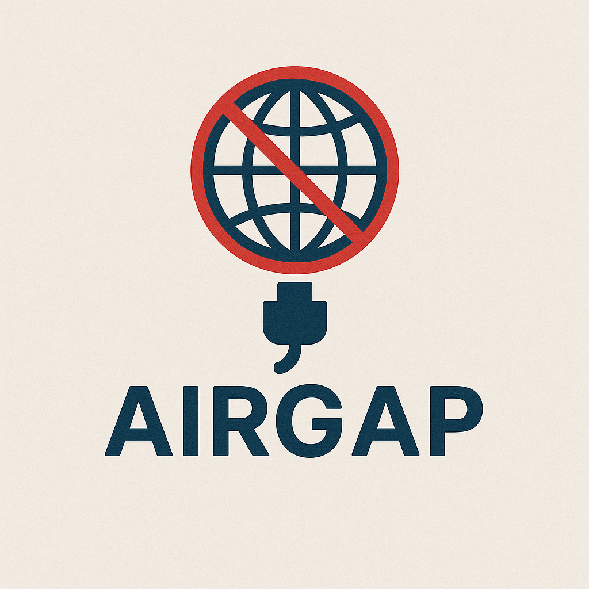

<div align="center">
  
  <h1>Swift Airgap</h1>
  <p><strong>Stop your unit tests from accidentally hitting real APIs.</strong></p>
</div>

Detect and fail any test that attempts a real HTTP/HTTPS network request. Drop-in, zero dependencies, supports both XCTest and Swift Testing. Works on iOS, macOS, tvOS, and watchOS.

[](https://swiftpackageindex.com/garry-jeromson/swift-airgap)
[](https://swiftpackageindex.com/garry-jeromson/swift-airgap)

## Overview

Tests should never make real outgoing network calls — they slow down the suite, cause flaky failures, and can hit production APIs. Airgap provides a mechanism to catch and report any test that attempts a real HTTP/HTTPS request.

## Installation

Add the package to your `Package.swift` or Xcode project:

```swift
.package(url: "https://github.com/garry-jeromson/swift-airgap.git", from: "1.5.0")
```

Then add `"Airgap"` to your test target's dependencies.

## Quick Start

### XCTest

Set `AirgapObserver` as the test bundle's principal class — no changes to existing test classes required:

```xml
<key>NSPrincipalClass</key>
<string>AirgapObserver</string>
```

### Swift Testing

Apply the `.airgapped` trait to a suite or test:

```swift
import Airgap
import Testing

@Suite(.airgapped)
struct MyFeatureTests {
    @Test func fetchData() async throws {
        // Any HTTP/HTTPS request here will record an Issue
    }
}
```

## XCTest

### Entire test target — NSPrincipalClass (recommended)

Use `AirgapObserver` as the test bundle's principal class. No changes to existing test classes required.

**Option A** — Add to your test target's Info.plist:
```xml
<key>NSPrincipalClass</key>
<string>AirgapObserver</string>
```

**Option B** — Set via build setting:
Set `INFOPLIST_KEY_NSPrincipalClass` to `AirgapObserver` in the test target's build settings.

The observer activates the guard before any test runs and deactivates it after all tests finish. Individual tests opt out with `Airgap.allowNetworkAccess()`.

> **Note:** `NSPrincipalClass` requires an Info.plist, so it works with Xcode test bundles but not standalone SPM test targets. For SPM packages, use the `.airgapped` trait or manual activation.

### Entire test target — base class

If you already have a shared base test class, add activation there:

```swift
class BaseTestCase: XCTestCase {
    override func setUp() {
        super.setUp()
        Airgap.activate()
    }

    override func tearDown() {
        Airgap.deactivate()
        super.tearDown()
    }
}
```

### Individual test suite — AirgapTestCase

Inherit from `AirgapTestCase`:

```swift
final class MyTests: AirgapTestCase {
    // All tests in this suite are protected
}
```

Override `configure()` to customize settings per-class. It runs after environment variables are applied and before `activate()`:

```swift
final class MyTests: AirgapTestCase {
    override func configure() {
        Airgap.mode = .warn
        Airgap.allowedHosts = ["localhost"]
    }
}
```

### Manual per-test

```swift
func testSomething() {
    Airgap.activate()
    defer { Airgap.deactivate() }
    // ...
}
```

### AirgapObserver vs AirgapTestCase

Both activate the guard automatically, but they differ in scope:

- **`AirgapObserver`** runs at the test-bundle level. It activates the guard once in `testBundleWillStart` and deactivates in `testBundleDidFinish`. Violations accumulate across all tests in the bundle, and the allow flag is automatically reset between tests.
- **`AirgapTestCase`** runs at the test-class level. It activates in `setUp()` and deactivates in `tearDown()`. Violations are cleared in `setUp()`, so each class starts with a clean slate.

Choose `AirgapObserver` when you want bundle-wide coverage with a single violation report. Choose `AirgapTestCase` when you want per-class isolation.

## Swift Testing

### Suite-level — `.airgapped` trait

Apply the trait to a `@Suite` to protect all tests within it:

```swift
@Suite(.airgapped)
struct MyTests {
    @Test func fetchData() async throws {
        // Any HTTP/HTTPS request here will record an Issue
    }
}
```

The trait automatically serializes `.airgapped` scopes process-wide, so concurrent suites don't corrupt each other's configuration. Adding `.serialized` is optional but avoids lock contention overhead if your suites would otherwise run in parallel.

> **Note:** The `.airgapped` trait's runtime scoping (automatic activate/deactivate around each test) requires **Swift 6.1+** (Xcode 16.3+). On Swift 6.0, the trait compiles and can be applied as metadata, but `provideScope` is absent — use manual `Airgap.activate()`/`deactivate()` calls instead.

The trait automatically reports violations via `Issue.record()` and activates/deactivates the guard around each test. Violations are collected during the test body and reported in the trait's scope teardown, so they are correctly attributed to the test that triggered them.

To opt out an individual test within a guarded suite, call `Airgap.allowNetworkAccess()` at the start of the test body — see [Allowing Network Access](#allowing-network-access).

### Test-level — `.airgapped` trait

Apply the trait to an individual test:

```swift
@Test(.airgapped)
func fetchData() async throws { ... }
```

## Allowing Network Access

Tests that legitimately need network access can opt out:

```swift
// XCTest — opt out an entire suite
final class IntegrationTests: AirgapTestCase {
    override func setUp() {
        super.setUp()
        Airgap.allowNetworkAccess()
    }
}

// XCTest — opt out a single test
func testWithRealNetwork() {
    Airgap.allowNetworkAccess()
    // Real network calls are allowed
}

// Swift Testing — opt out a single test within a guarded suite
@Suite(.airgapped)
struct MyTests {
    @Test func integrationTest() async throws {
        Airgap.allowNetworkAccess()
        // Real network calls are allowed
    }
}
```

The allow flag is automatically reset on the next `activate()` call.

### Allowed Hosts

Allow specific hosts or domains to pass through even when the guard is active. Useful for tests that hit localhost or a mock server:

```swift
Airgap.allowedHosts = ["localhost", "127.0.0.1"]
```

Wildcard patterns are supported:

```swift
Airgap.allowedHosts = ["*.mock-server.local"]  // matches api.mock-server.local, etc.
```

Matching is case-insensitive per RFC 3986. Allowed hosts persist across `activate()`/`deactivate()` cycles — they are configuration, not per-test state.

> **Note:** Host matching uses `URL.host`, which does not include the port. Patterns like `"localhost:8080"` will never match — use `"localhost"` instead.

#### With the `.airgapped` trait

Pass allowed hosts directly to the trait. Hosts set via the trait parameter are scoped to that test or suite — they are added on entry and restored on exit, without affecting the global `allowedHosts` setting:

```swift
@Suite(.airgapped(allowedHosts: ["localhost", "127.0.0.1"]))
struct MyTests {
    // localhost requests are allowed; all others are blocked
}
```

#### Environment variable

Set `AIRGAP_ALLOWED_HOSTS` to a comma-separated list of hosts. Both `AirgapObserver` and `AirgapTestCase` read this automatically via `configureFromEnvironment()`:

```
AIRGAP_ALLOWED_HOSTS=localhost,127.0.0.1,*.mock-server.local
```

### Passthrough Protocols

If you use a mock URLProtocol framework (e.g., Mocker, OHHTTPStubs), you can tell Airgap to yield to it for requests the mock handles. Unmocked requests are still blocked:

```swift
Airgap.passthroughProtocols = [MockingURLProtocol.self]
Airgap.activate()
```

When a request arrives, Airgap checks each passthrough protocol's `canInit(with:)`. If any returns `true`, Airgap yields and lets that protocol handle the request. This lets mock and stub frameworks coexist with Airgap — mocked requests go through the mock, unmocked requests are blocked.

## Warning Mode

By default, Airgap fails tests immediately on any violation (`.fail` mode). Use `.warn` mode to detect violations without failing tests — violations appear as expected failures in Xcode's issue navigator.

### Swift Testing trait

```swift
@Suite(.airgapped(mode: .warn))
struct MyTests {
    // Violations appear as known issues in the test navigator via withKnownIssue
}
```

Combine with allowed hosts:

```swift
@Suite(.airgapped(mode: .warn, allowedHosts: ["localhost"]))
struct MyTests { ... }
```

### Programmatic

```swift
Airgap.mode = .warn
Airgap.activate()
```

### Custom observer subclass (recommended for Xcode test bundles)

Subclass `AirgapObserver` to configure warn mode and a report path programmatically. Set your subclass as the `NSPrincipalClass` in the test bundle's Info.plist:

```swift
import Airgap

@objc(MyTestObserver)
final class MyTestObserver: AirgapObserver {
    override func testBundleWillStart(_ testBundle: Bundle) {
        Airgap.mode = .warn
        Airgap.reportPath = "/path/to/report.txt"
        super.testBundleWillStart(testBundle)
    }
}
```

```xml
<key>NSPrincipalClass</key>
<string>MyTestObserver</string>
```

### Environment variable

Set `AIRGAP_MODE=warn` in your Xcode scheme's environment variables. Both `AirgapObserver` and `AirgapTestCase` read this automatically.

## Violation Report

Generate a file listing all violations with HTTP method, URL, test name, and call stack.

### Programmatic

```swift
Airgap.reportPath = "/tmp/airgap-report.txt"
Airgap.activate()
// ... run tests ...
Airgap.writeReport()
```

### Custom observer subclass

See the [Warning Mode](#warning-mode) section above for a complete example.

### Environment variable

Set `AIRGAP_REPORT_PATH=/path/to/report.txt` in your Xcode scheme's environment variables. The report is written automatically when the test bundle finishes (`AirgapObserver`) or during tearDown (`AirgapTestCase`).

### Report format

Use a `.json` extension to get structured JSON output for CI/CD pipelines:

```swift
Airgap.reportPath = "/tmp/airgap-report.json"
```

The JSON format encodes the `Violation` array directly using `JSONEncoder` with ISO 8601 dates.

For human-readable output, use any other extension (e.g., `.txt`):

```
Airgap Violation Report
Generated: 2026-02-25 14:30:00
Total violations: 2

---
Test: -[MyTests testFetchUser]
Method: GET
URL: https://api.example.com/user/123
Call Stack:
  MyService.fetchUser() + 42
  MyTests.testFetchUser() + 18
  XCTestCase.invokeTest() + 123
  ...

---
Test: -[MyTests testPostData]
Method: POST
URL: https://api.example.com/data
Call Stack:
  NetworkClient.request(_:) + 56
  MyService.postData(_:) + 31
  ...
```

> **Note:** Call stacks in the report are truncated to 10 frames.

## Programmatic Violation Access

Violations are always collected in `Airgap.violations`, regardless of whether a `reportPath` is set:

```swift
// After tests run:
print(Airgap.violations.count)          // Number of violations
print(Airgap.violationSummary() ?? "")  // e.g. "Airgap: 3 violation(s) detected across 2 test(s)"

// Each violation contains:
let v = Airgap.violations[0]
v.testName    // "-[MyTests testFetchUser]"
v.httpMethod  // "GET"
v.url         // "https://api.example.com/user/123"
v.callStack   // [String] — symbolicated stack frames
v.timestamp   // Date — when the violation was detected
v.contentType // String? — Content-Type header, if present

// Reset:
Airgap.clearViolations()
```

`Violation` conforms to `Codable`, so you can serialize violations to JSON:

```swift
let data = try JSONEncoder().encode(Airgap.violations)
let json = String(data: data, encoding: .utf8)!
```

## Environment Variables

| Variable | Values | Description |
|---|---|---|
| `AIRGAP_MODE` | `warn` | Enables warning mode (no test failures) |
| `AIRGAP_REPORT_PATH` | `/path/to/report.txt` | Writes a violation report to this path |
| `AIRGAP_ALLOWED_HOSTS` | `localhost,127.0.0.1` | Comma-separated hosts to allow through |
| `AIRGAP_ERROR_CODE` | `-1009` | URL error code delivered to intercepted requests |

All four are read by `Airgap.configureFromEnvironment()`, which is called automatically by `AirgapObserver` and `AirgapTestCase`.

## Custom Failure Handling

The default handler calls `XCTFail()`. You can set a custom handler for manual activation flows:

```swift
// Swift Testing (manual)
Airgap.violationHandler = { Issue.record("\($0)") }

// Custom logging
Airgap.violationHandler = { message in
    logger.error("Unexpected network call: \(message)")
}
```

### Structured Violation Reporter

In addition to `violationHandler` (which receives a formatted string), you can set `violationReporter` to receive the full `Violation` struct for structured analytics or CI integration:

```swift
Airgap.violationReporter = { violation in
    analytics.track("network_violation", properties: [
        "url": violation.url,
        "method": violation.httpMethod,
        "test": violation.testName
    ])
}
```

`violationReporter` fires on every violation immediately (even within `.airgapped` trait scopes). Set to `nil` to disable (default). Note that when using the `.airgapped` trait, `violationHandler` is managed by the trait — set `violationReporter` for custom structured reporting instead.

## Scoped Configuration

Use `Airgap.withConfiguration()` to temporarily override settings for a block of code. All state is saved before and restored after, even if the body throws:

```swift
Airgap.withConfiguration(mode: .warn, allowedHosts: ["localhost"]) {
    // Run code with temporary overrides
}
// Original settings are restored here
```

All parameters are optional — only the ones you pass are changed:

```swift
Airgap.withConfiguration(mode: .warn) {
    // Only mode is overridden; allowedHosts, errorCode, etc. keep their current values
}
```

> **Note:** `withConfiguration` accepts a synchronous closure. For async test scopes, use the `.airgapped` trait instead.

## Error Customization

### Error Code

By default, intercepted requests receive `NSURLErrorNotConnectedToInternet`. Change this to test specific error handling paths:

```swift
Airgap.errorCode = NSURLErrorTimedOut
```

### Response Delay

Add a delay before the error is delivered, useful for testing loading states or timeout handling:

```swift
Airgap.responseDelay = 2.0  // seconds
```

Default is `0` (no delay).

## Advanced

### `Airgap.isActive`

Check whether the network guard is currently active:

```swift
if Airgap.isActive {
    // Guard is active
}
```

### `Airgap.inXCTestContext`

The `inXCTestContext` property controls whether warn mode uses `XCTExpectFailure` to wrap violations as expected failures. When `true`, violations in `.warn` mode are reported via `XCTExpectFailure` so they appear as expected failures in Xcode rather than actual failures. When `false`, the violation handler is called directly.

`AirgapObserver` and `AirgapTestCase` set this to `true` automatically. If you integrate Airgap manually (e.g., via `Airgap.activate()` in a base class), set it yourself:

```swift
Airgap.inXCTestContext = true
Airgap.activate()
```

The `.airgapped` Swift Testing trait does not set `inXCTestContext` — it uses `Issue.record()` instead.

## What Gets Blocked

| Source | Blocked? |
|--------|----------|
| `URLSession.shared` | Yes |
| `URLSession(configuration: .default)` | Yes |
| `URLSession(configuration: .ephemeral)` | Yes |
| Custom `URLSessionConfiguration` (e.g., `.background`) | Yes — for sessions created after `activate()` (via session-init swizzle) |
| Alamofire, Moya, and other URLSession-backed libraries | Yes |
| `http://` URLs | Yes |
| `https://` URLs | Yes |
| `URLSessionWebSocketTask` (`wss://`, `ws://`) | Yes — detected in the resume swizzle, task is cancelled |

## What Doesn't Get Blocked

| Source | Reason |
|--------|--------|
| `file://` URLs | Non-HTTP scheme, intentionally allowed |
| `data:` URLs | Non-HTTP scheme, intentionally allowed |
| Requests handled by a `passthroughProtocols` entry | Airgap yields if another URLProtocol's `canInit(with:)` returns `true` |
| `Data(contentsOf: remoteURL)` | Uses a lower-level loading path that bypasses URLProtocol |
| Sessions created before `activate()` with a custom configuration | The session already exists; swizzling can only inject at creation time |

## Parallelism & Serialization

Airgap uses process-global state (`isActive`, `violationHandler`, `currentTestName`, `allowedHosts`, `mode`, etc.) to configure interception and route violations back to the correct test. This means `.airgapped` test scopes cannot run concurrently within the same process — if they did, one scope's configuration would stomp on another's, causing violations to be attributed to the wrong test, wrong handlers to fire, or one scope's `deactivate()` to kill another scope's interception.

### Swift Testing

The `.airgapped` trait automatically serializes scopes process-wide using an internal async mutex. You can safely apply `.airgapped` to multiple independent suites without worrying about races:

```swift
// These are safe — the trait serializes them automatically
@Suite(.airgapped) struct FeatureATests { ... }
@Suite(.airgapped) struct FeatureBTests { ... }
```

Adding `.serialized` to your suites is optional. It avoids lock contention overhead by telling Swift Testing not to attempt parallel execution in the first place, but the mutex ensures correctness either way.

Tests that don't use `.airgapped` are unaffected and run in parallel normally.

### XCTest

XCTest's default parallel execution model runs test **targets** in separate processes, so each process has its own copy of Airgap's static state — no issue. Within a single process, XCTest runs test classes sequentially by default.

If you enable Xcode's "Execute in parallel" option for test classes within the same target, `AirgapTestCase` and `AirgapObserver` do not currently serialize access. This is uncommon in practice, but if you hit it, either disable parallel class execution for the Airgap-protected target or use manual `activate()`/`deactivate()` with your own synchronization.

### Why not per-test isolation?

The fundamental constraint is Apple's `URLProtocol` architecture: `startLoading()` runs on an internal `com.apple.CFNetwork.CustomProtocols` thread, not in the caller's task context. Task-local values don't propagate there, so there's no way to use Swift's structured concurrency to scope Airgap state per-test. Every intercepted request lands in the same global `URLProtocol` subclass with no correlation back to the originating test.

A future approach could inject a scope identifier into each request (via a URLProtocol property) at the `resume()` swizzle point, then route violations to the correct scope in `startLoading()`. This would eliminate the serialization constraint but requires a significant architectural change.

## How It Works

1. **URLProtocol registration** — `URLProtocol.registerClass()` intercepts requests made through `URLSession.shared`
2. **Configuration swizzling** — The getters for `URLSessionConfiguration.default` and `.ephemeral` are swizzled to inject the guard protocol into every new configuration
3. **Session-init swizzling** — The `URLSession` designated initializer is swizzled to inject the guard protocol at session creation time, catching sessions created from configs obtained before `activate()` or from non-standard configs (e.g., `.background`)
4. **Resume swizzling** — `URLSessionTask.resume()` is swizzled to capture accurate call stacks at the point where user code initiates the request, and to intercept WebSocket tasks directly (since URLProtocol cannot intercept WebSocket connections)
5. **Scheme filtering** — Only `http://`, `https://`, `ws://`, and `wss://` schemes are intercepted; `file://`, `data:`, and others pass through
6. **Error delivery** — Intercepted requests receive a configurable error code (default `NSURLErrorNotConnectedToInternet`) with optional delay, so code under test gets an error rather than hanging

## Troubleshooting

**Tests fail with "Airgap: Blocked request..."**
Your test is making a real network call. Replace it with a mock or stub, or call `Airgap.allowNetworkAccess()` if the test genuinely needs network access.

**Guard doesn't catch requests from a pre-existing session**
Sessions created after `activate()` are automatically covered, even with custom configurations like `.background`. However, sessions created *before* `activate()` with a non-standard configuration won't have the guard protocol injected. Manually add `AirgapURLProtocol` to the configuration's `protocolClasses` for these cases.

**`Data(contentsOf:)` requests are not caught**
`Data(contentsOf:)` for remote URLs does not go through URLProtocol. This API is synchronous and discouraged by Apple. Use `URLSession` instead.

**`NSPrincipalClass` doesn't work in SPM test targets**
SPM test targets don't have an Info.plist, so `NSPrincipalClass` is not available. Use the `.airgapped` trait (Swift Testing) or manual `activate()`/`deactivate()` calls instead.
